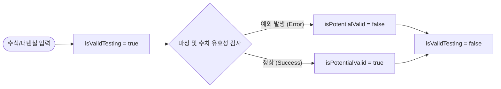
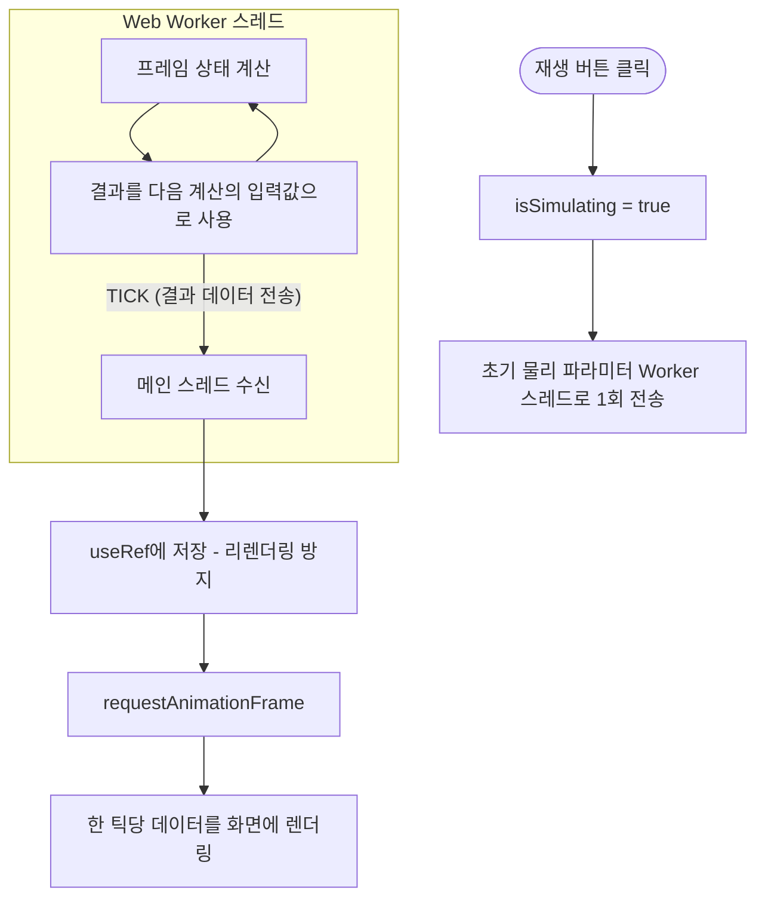

# Workspace State Flow

## 1. 개요
본 문서는 워크스페이스 내 데이터 동기화 및 상태 관리 전략을 정의하며, 모든 상태는 `SimulationContext`를 통해 관리된다.

### A. Workspace State Variables

#### A.1 공통 물리 및 환경 설정 (Common)
| 변수명 | 타입 | 의미 | 초기값 |
| :--- | :--- | :--- | :--- |
| **type** | ENUM | 시뮬레이션 공간 차원 ('1D', '2D') | '1D' |
| **mass** | Number | 입자 질량 | 1.0 |
| **length** | Number | 계 전체 길이 (2D는 정사각형 L) | 10.0 |
| **gridSteps** | Number | 격자점 수 (2D는 N*N) | 512 |
| **timeStep** | Number | 시간 진화 시간 간격 (dt) | 0.1 |
| **potentialMode** | ENUM | 수식 입력 / 드래그 모드 선택 | 'draw' |
| **isCalculating** | Boolean | 엔진 계산 진행 중 여부 (Stationary) | false |
| **isSimulating** | Boolean | 시뮬레이션 진행 여부 (Evolution) | false |
| **simulationTime**| Number | 경과 시간 (t) | 0.0 |
| **isValidTesting**  | Boolean | 퍼텐셜 유효성 검사 진행 중 여부 | false |

#### A.2 1D 전용 상태 (1D Specific)
| 변수명 | 타입 | 의미 | 초기값 |
| :--- | :--- | :--- | :--- |
| **potentialRaw1D** | String | 1D 사용자 입력 수식/데이터 | '' |
| **potentialArray1D** | Array | 1D 격자점별 퍼텐셜 값 | [] |
| **wavePacket1D** | Object | 1D 패킷 (x0, k0, sigma) | { x0: 0, k0: 5, sigma: 1 } |
| **eigenvalues1D** | Array | 1D 에너지 고유값 배열 | [] |
| **eigenstate1D** | Array | 1D 정적 파동함수 데이터 | [] |
| **currentPsi1D** | Array | 1D 현재 파동함수 ($\psi(x, t)$) | [] |

#### A.3 2D 전용 상태 (2D Specific)
| 변수명 | 타입 | 의미 | 초기값 |
| :--- | :--- | :--- | :--- |
| **potentialRaw2D** | String | 2D 사용자 입력 수식/데이터 | '' |
| **potentialArray2D** | Array | 2D 격자점별 퍼텐셜 값 | [] |
| **wavePacket2D** | Object | 2D 패킷 (x0, y0, kx0, ky0, sigma) | { x0:0, y0:0, kx0:5, ky0:5, sigma:1 } |
| **eigenvalues2D** | Array | 2D 에너지 고유값 배열 | [] |
| **eigenstate2D** | Array | 2D 정적 파동함수 데이터 | [] |
| **currentPsi2D** | Array | 2D 현재 파동함수 ($\psi(x,y,t)$) | [] |

#### A.4 분석 및 제어 설정
| 변수명 | 타입 | 의미 | 초기값 |
| :--- | :--- | :--- | :--- |
| **analysisMode** | ENUM | 분석 모드 ('stationary', 'evolution') | 'stationary' |
| **targetStateIndex**| Number | 선택한 고유 상태 인덱스 | 0 |
| **isPotentialValid**| Boolean | 현재 퍼텐셜 입력의 유효성 여부 | false |

#### A.5 State Flow (Visual Logic)

**1. 시뮬레이션 실행 흐름 (Stationary Simulation)**

**2. 입력 유효성 검증 흐름 (Input Validation)**

**3. 시간 진화 시뮬레이션 흐름 (Time Evolution)**

